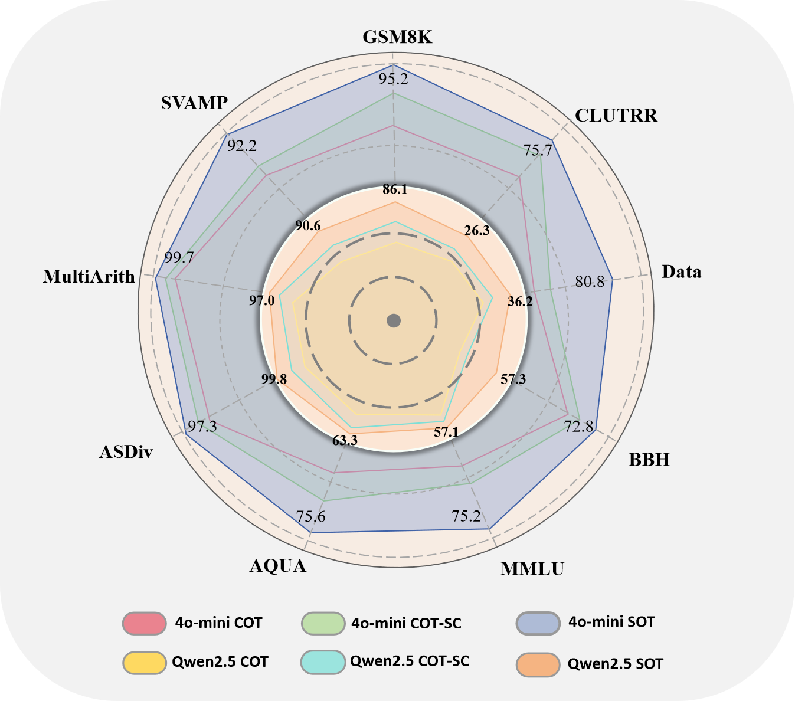
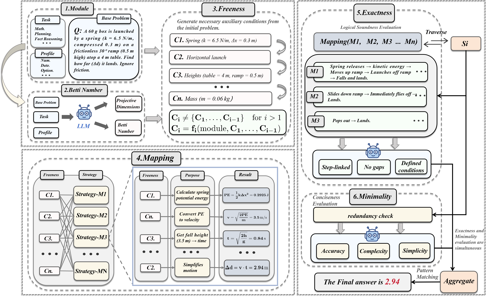

# Syzygy-of-thoughts
🚀 **Hello, [社交平台账号](https://www.youtube.com/watch?v=gZABle836yM)**  
- xxxxxxxxxxxxxxxxxxxxxxx

<div align='left'>

</div>
本项目为论文《Syzygy of Thoughts: Enhancing LLM Reasoning with Minimal Free Resolution》的代码实现。该论文提出了一种新颖的推理框架 Syzygy of Thoughts (SoT)，通过将交换代数与同调代数中的 最小自由分解 (Minimal Free Resolution, MFR) 原理融入思维链 (Chain of Thought, CoT)，显著提升大型语言模型 (LLM) 在复杂推理任务中的性能。SoT 针对传统 CoT 在高维、非线性推理中的局限，引入模块、自由性、映射、精确性、最小性和 Betti 数等结构化分解策略，将复杂问题转化为紧凑且逻辑自洽的推理单元。
实验在 GSM8K 和 MATH 等数据集上进行，涵盖 GPT-4o-mini、Qwen2.5 等模型，SoT 的推理准确率达到或超越主流 CoT 标准（例如，GSM8K 96.0%，MATH 79.1%），且在高温条件下保持稳定性，推理时间更具可扩展性。


<div align='left'>

</div>


## Highlight## 

本项目实现了《Syzygy of Thoughts》论文中的 SoT 推理框架，包含数据集、模型配置、源代码和实验结果。以下是项目目录结构：

```plaintext
SoT-Paper-Code/
├── **data/**                     # 数据集存放目录
│   ├── gsm8k/                    # GSM8K 数学推理数据集
│   ├── math/                     # MATH 高级数学数据集
│   ├── svamp/                    # SVAMP 数学推理数据集
│   └── others/                   # 其他数据集（MultiArith、ASDiv、AQUA 等）
├── **models/**                   # 模型配置文件目录
│   ├── gpt4o_mini/               # GPT-4o-mini 模型配置
│   ├── qwen2.5/                  # Qwen2.5 系列模型配置
│   └── gemma/                    # Gemma 模型配置
├── **src/**                      # 源代码目录
│   ├── **sot.py**                # SoT 推理框架核心实现
│   ├── cot.py                    # CoT 基线推理实现
│   ├── cot_sc.py                 # CoT-SC (n=5) 推理实现
│   ├── mfr_utils.py              # 最小自由分解工具函数
│   └── evaluate.py               # 性能评估脚本
├── **experiments/**              # 实验结果与可视化
│   ├── figures/                  # 实验图表（折线图、箱型图等）
│   └── logs/                     # 实验运行日志
├── **requirements.txt**          # 项目依赖环境配置
├── **README.md**                 # 项目说明文档
└── run.sh                        # 一键运行脚本s
SoT-Paper-Code/
├── data/                     # 数据集文件
│   ├── gsm8k/                # GSM8K 数据集
│   ├── math/                 # MATH 数据集
│   ├── svamp/                # SVAMP 数据集
│   └── others/               # 其他数据集（MultiArith, ASDiv, AQUA 等）
├── models/                   # 模型配置文件
│   ├── gpt4o_mini/           # GPT-4o-mini 配置
│   ├── qwen2.5/              # Qwen2.5 配置
│   └── gemma/                # Gemma 模型配置
├── src/                      # 源代码
│   ├── sot.py                # SoT 推理框架实现
│   ├── cot.py                # CoT 基线实现
│   ├── cot_sc.py             # CoT-SC (n=5) 实现
│   ├── mfr_utils.py          # MFR 工具函数
│   └── evaluate.py           # 评估脚本
├── experiments/              # 实验结果与可视化
│   ├── figures/              # 图表（折线图、箱型图）
│   └── logs/                 # 实验日志
├── requirements.txt          # 依赖环境
├── README.md                 # 项目说明
└── run.sh                    # 运行脚本
```


## Overview
- [Schedule](#schedule)
- [Citation](#citation)
- [Installation](#installation)
- [API Configuration Setup](#api-configuration-setup)
- [Data Preparation](#data-preparation)
- [Quick Start](#quick-start)
- [Model Zoo](#model-zoo)


## Schedule
介绍xxxxxx:
- [x] xxx
- [x] xxx
  - [x] xxx
  - [x] xxx
  - [x] xxx


## Citation
If you find SoT useful to your research, please cite our work as an acknowledgment.(*^▽^*)
```bib

```


## Installation

### 1.克隆项目仓库

首先，将项目仓库克隆到本地。打开终端或命令提示符，执行以下命令：

```
git clone https://github.com/piotrkawa/audio-deepfake-source-tracing.git
cd audio-deepfake-source-tracing
```
### 2.创建虚拟环境（可选但推荐）

为避免项目依赖与系统环境中的其他 Python 包冲突，建议使用虚拟环境。可使用venv（Python 内置的虚拟环境工具）来创建和管理虚拟环境。

```
推荐使用anaconda进行环境管理
#创建虚拟环境
conda create -n venv pyrhon=3.9

#激活虚拟环境
conda activate venv

# 创建虚拟环境
python -m venv venv python=3.9

# 激活虚拟环境
# 在Windows上
.\venv\Scripts\activate
# 在Linux/Mac上
source venv/bin/activate
```

### 3.安装项目依赖

项目依赖库信息记录在requirements.txt文件中，使用pip安装这些依赖：

```
pip install -r requirements.txt
```

### 4.数据准备
项目提供了实验使用的数据集以及目前广为使用的数据集，方便您进行自己的实验和运行我们的代码
项目默认数据集路径在sot.yaml文件的runner.default_dataset字段中指定，确保该路径下的数据集文件存在。若要使用其他数据集，可修改该字段的值

### 5.运行项目
安装完成后，可按照以下命令运行项目：
```
python main.py
```

## 常见问题及解决方法
## 1.依赖安装失败
确保网络连接正常，并且requirements.txt文件中的依赖版本与 Python 版本兼容。可尝试手动安装每个依赖，或者更新pip到最新版本：

```
pip install --upgrade pip
```
### 2.虚拟环境激活失败
确保使用的命令与操作系统兼容。在 Windows 上使用 PowerShell 时，可能需要以管理员身份运行 PowerShell 才能激活虚拟环境。
### 3.数据集加载失败
检查sot.yaml文件中的runner.default_dataset路径是否正确，以及数据集文件格式是否符合要求（通常为 JSON 或 JSONL 格式）。
## API Configuration Setup

Before using the Syzygy-of-thoughts (SoT) framework, you need to set up your API key and URL:

1. Create an `Syzygy-of-thoughts/config/sot.yaml` file in the project root directory with the following format:

```
url = "https://api.openai.com/v1"  # Replace with your API endpoint
api_key = [
    "your-api-key-here",  # Replace with your actual API key
    # You can add multiple API keys to improve concurrency performance.
]
```

### 获取 API Key

请根据下列平台获取您的 API Key：

- **ChatGPT**: [注册并获取 API Key](https://platform.openai.com/signup)
- **Qwen (通义千问)**: [登录并获取 API Key](https://bailian.console.aliyun.com/?tab=model#/api-key)
- **Gemma**: [创建账户并获取 API Key](https://www.netmind.ai/user/apiToken)

获取 API Key 后，您可以将其配置到项目中以启用相关功能。


### Requirements
 Syzygy-of-thoughts :

(Recommendation)
- Ubuntu: 
- CUDA: 
- PyTorch: 

### Environment
# 改成我们自己的

## Data Preparation
Please further refer xxx

## Quick Start
xxxxxxxxxxxxx


## Model Zoo
### 1. 实验性能
以下表格比较了 CoT、CoT-SC (n=5) 和 SoT 在多种任务上的性能，涵盖数学推理（GSM8K、SVAMP、MultiArith、ASDiv、AQUA）、通用知识（MMLU）、多任务问答（BBH）、时间推理（Date）和逻辑推理（CLUTRR）。SoT 在所有模型和任务中均取得最佳表现。
| **Method**                        | **GSM8K** | **SVAMP** | **MultiArith** | **ASDiv** | **AQUA** | **MMLU** | **BBH** | **Date** | **CLUTRR** |
|------------------------------------|:---------:|:---------:|:--------------:|:---------:|:--------:|:--------:|:-------:|:--------:|:----------:|
| **GPT-4o-mini**                    |           |           |                |           |          |          |         |          |            |
| CoT                                | 85.1%     | 84.4%     | 99.2%          | 97.0%     | 65.0%    | 63.1%    | 66.3%   | 51.8%    | 65.9%      |
| CoT-SC (n=5)                       | 90.1%     | 86.0%     | 99.5%          | 98.5%     | 70.9%    | 67.3%    | 69.2%   | 54.9%    | 72.4%      |
| **SoT (Ours)**                     | **96.0%** | **92.2%** | **99.7%**      | **99.8%** | **75.6%** | **75.2%** | **72.8%** | **75.2%** | **75.7%**  |
| **Qwen2.5-Coder-7B-Instruct**      |           |           |                |           |          |          |         |          |            |
| CoT                                | 77.2%     | 82.4%     | 92.3%          | 92.0%     | 60.6%    | 55.1%    | 47.1%   | 31.0%    | 20.1%      |
| CoT-SC (n=5)                       | 80.2%     | 84.1%     | 95.0%          | 95.0%     | 62.2%    | 56.3%    | 49.3%   | 32.9%    | 21.0%      |
| **SoT (Ours)**                     | **89.1%** | **90.6%** | **97.0%**      | **99.8%** | **63.3%** | **57.1%** | **57.3%** | **36.2%** | **26.3%**  |
| **Qwen2.5-VL-72B-Instruct**        |           |           |                |           |          |          |         |          |            |
| CoT                                | 86.1%     | 86.9%     | 98.8%          | 98.0%     | 81.1%    | 80.1%    | 77.3%   | 75.2%    | 70.1%      |
| CoT-SC (n=5)                       | 89.1%     | 88.2%     | 99.3%          | 98.4%     | 83.9%    | 82.9%    | 79.0%   | 78.0%    | 75.0%      |
| **SoT (Ours)**                     | **96.0%** | **95.8%** | **99.7%**      | **99.2%** | **89.4%** | **84.3%** | **85.3%** | **80.2%** | **78.9%**  |
| **Gemma-3-27b-it**                 |           |           |                |           |          |          |         |          |            |
| CoT                                | 83.1%     | 85.9%     | 91.9%          | 98.5%     | 80.3%    | 70.8%    | 70.7%   | 76.9%    | 65.3%      |
| CoT-SC (n=5)                       | 87.1%     | 87.0%     | 92.3%          | 99.2%     | 85.4%    | 73.2%    | 73.2%   | 80.2%    | 66.4%      |
| **SoT (Ours)**                     | **96.0%** | **95.8%** | **99.7%**      | **99.2%** | **89.4%** | **84.3%** | **85.3%** | **80.2%** | **78.9%**  |
| **Gemma-3-12b-it**                 |           |           |                |           |          |          |         |          |            |
| CoT                                | 83.2%     | 79.0%     | 90.4%          | 97.7%     | 68.9%    | 68.1%    | 64.6%   | 77.7%    | 49.0%      |
| CoT-SC (n=5)                       | 86.1%     | 81.0%     | 93.3%          | 98.0%     | 71.7%    | 70.6%    | 66.7%   | 80.2%    | 52.2%      |
| **SoT (Ours)**                     | **92.1%** | **92.5%** | **96.1%**      | **99.2%** | **77.2%** | **72.3%** | **69.1%** | **82.5%** | **55.0%**  |


