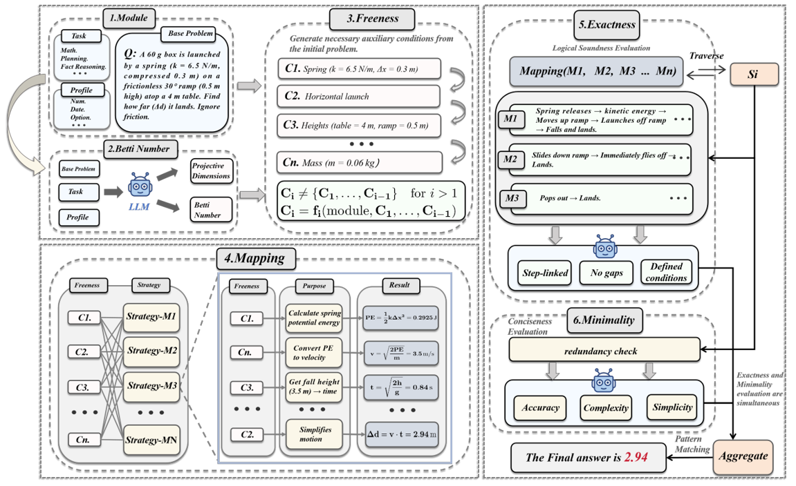

# Syzygy-of-Thoughts
<p align="center">
 
 <h3 align="center">"Syzygy" is derived from the Greek word syzygia (συσυγία), meaning "union" or "pairing".</h3>
</p>
This project is the code implementation for the paper Syzygy of Thoughts: Enhancing LLM Reasoning with Minimal Free Resolution. The paper proposes a novel reasoning framework, Syzygy of Thoughts (SoT), which integrates principles from commutative algebra and homological algebra, specifically Minimal Free Resolution (MFR), into the Chain of Thought (CoT) approach, significantly improving the performance of large language models (LLMs) on complex reasoning tasks.


<div align='left'>

</div>


## Project Structure

This project implements the SoT reasoning framework from the Syzygy of Thoughts paper, including datasets, model configurations, source code, and experimental results. The project directory structure is as follows:

```plaintext
project
├── config                       # Configuration files directory
│   ├── sot.yaml                 # SoT framework configuration file
│   └── settings.py              # Global project settings script
├── interfaces                   # Interface definitions directory
│   └── __init__.py              # Interface initialization file
├── models                       # Model interfaces directory
│   └── openai_client.py         # OpenAI model client implementation
├── prompts                      # Prompt templates directory
│   └── sot_prompt.py            # SoT inference prompt template
├── utils                        # Utility functions directory
│   ├── dataloader.py            # Data loading utilities
│   ├── parse_answer.py          # Answer parsing function
│   ├── parse_factory.py         # Answer parsing factory
│   ├── answer_validator.py      # Answer validation utilities
│   ├── get_prompt_template.py   # Prompt template retrieval function
│   └── runner.py                # Experiment running script
├── main.py                      # Main entry script of the project
└── app.log                      # Project runtime log

```


## Quick Start

### 1.Clone the Project Repository
First, clone the project repository to your local machine. Open a terminal or command prompt and execute the following command:

```
git clone https://github.com/piotrkawa/audio-deepfake-source-tracing.git
cd audio-deepfake-source-tracing
```
### 2.Create a Virtual Environment (Recommended)

To avoid conflicts between project dependencies and other Python packages in your system environment, it is recommended to use a virtual environment. Here are two methods to create a virtual environment: using `Anaconda` or `Python` built-in `venv` tool.

#### Using `Anaconda`

```
# Create a virtual environment
conda create -n venv python=3.9

# Activate the virtual environment
conda activate venv
```
#### Using `venv`
```
# Create a virtual environment
python -m venv venv

# Activate the virtual environment
# On Windows
.\venv\Scripts\activate

# On Linux/Mac
source venv/bin/activate
```

### Install Project Dependencies
The project dependencies are listed in the `requirements.txt` file. Use pip to install them:

```
pip install -r requirements.txt
```

### Data Preparation
Before running the project, you need to prepare the corresponding datasets. The project already provides several common datasets, such as mathematics, question-answering, sports, etc., to meet the needs of different test scenarios.  
The default dataset path for the project is specified in the `sot.yaml` file under the `runner.default_dataset` field. Make sure that the dataset files exist at that path. To use a different dataset, you can directly modify the value of this field.  
The project supports various dataset types, and the loading methods for different types may vary. The mapping for dataset loading functions is defined under the `dataset_loader_mapping` field in the `sot.yaml` file. For example:
```
dataset_loader_mapping:
  math: utils.dataloader.load_math_bbh_mmlu
  bbh: utils.dataloader.load_math_bbh_mmlu
  MMLU: utils.dataloader.load_math_bbh_mmlu
  gsm8k: utils.dataloader.load_other_datasets
  # Other dataset types...
```
### Configure API Information
The project uses the OpenAI API to call models. You need to configure the API key and related information in the `sot.yaml` file:
```
openai:
  api_key: 'your-actual-api-key'               # Replace with your own OpenAI API key
  model_name: gpt-4o-mini                      # The name of the model you are using
  base_url: https://api.nuwaapi.com/v1         # The network interface address of the model
  max_tokens: 2048                             # The maximum token length of the model's answer
  max_retries: 3                               # The number of retries for network timeouts
  temperature: 0.2                             # The temperature for the model
```
If the model you wish to use is not based on OpenAI's API, you can mimic the configuration format in `sot.yaml` for your model. For example, to configure for Google PaLM API:
```google:
  api_key: 'your-google-api-key'               # # Replace with your own Google API key
  model_name: models/text-bison-001            # The name of the Google model you're using
  base_url: https://generativelanguage.googleapis.com/v1beta2         # Google API base URL
  max_tokens: 2048                             # The maximum token length of the model's answer
  max_retries: 3                               # The number of retries for network timeouts
  temperature: 0.2                             # The temperature for the model
```
You will also need to make corresponding changes in the `settings.py` file under the config folder. Open the `settings.py` file, find the `Settings` class, and add the logic for reading the new configuration information.
Additionally, you will need to create a script similar to `openai_client.py` to initialize the new model. Create a new function to initialize the `Google PaLM` model.
### Run the Project
After completing the preparation steps, you can run the project for testing. Execute the following command in the project's root directory:
```
python main.py
```
After executing this command, the program will automatically load the dataset, configure the API information, and call the corresponding model for testing. Finally, it will output the test report, which includes the total number of questions, the number of correct answers, the accuracy rate, and the IDs of the incorrectly answered questions.

### Common Issues and Solutions
#### Dependency Installation Failed
Ensure that your network connection is stable and that the dependency versions in the `requirements.txt` file are compatible with your Python version. You can try manually installing each dependency or updating `pip` to the latest version:

```
pip install --upgrade pip
```
#### Virtual Environment Activation Failed
Ensure the command used is compatible with your operating system. On `Windows`, when using `PowerShell`, you may need to run `PowerShell` as an administrator to activate the virtual environment.
#### Dataset Loading Failed
Check if the `runner.default_dataset` path in the `sot.yaml` file is correct and ensure that the dataset file format is correct (usually in `JSON` or `JSONL` format).

### Get API Key

Follow these instructions to get your API Key:

-  **ChatGPT**: [Sign up and get API Key](https://platform.openai.com/signup)  
-  **Qwen (通义千问)**: [Log in and get API Key](https://bailian.console.aliyun.com/?tab=model#/api-key)  
-  **Gemma**: [Create an account and get API Key](https://www.netmind.ai/user/apiToken)

After obtaining your API key, you can configure it in the project to enable the relevant functionality.


## experiment
### 1. Experimental Performance

<div align='left'>

</div>
SoT (Ours) achieved performance improvements
compared to CoT and CoT-SC on two models across nine
datasets. The inner circle shows three methods of Qwen2.5,
while the outer circle shows three methods of 4o-mini.

### 2. Experimental Results
The following table compares the performance of CoT, CoT-SC (n=5), and SoT across various tasks, covering mathematical reasoning (GSM8K, SVAMP, MultiArith, ASDiv, AQUA), general knowledge (MMLU), multi-task question answering (BBH), time reasoning (Date), and logical reasoning (CLUTRR). SoT achieves the best performance across all models and tasks.
| **Method**                        | **GSM8K** | **SVAMP** | **MultiArith** | **ASDiv** | **AQUA** | **MMLU** | **BBH** | **Date** | **CLUTRR** |
|------------------------------------|:---------:|:---------:|:--------------:|:---------:|:--------:|:--------:|:-------:|:--------:|:----------:|
| **GPT-4o-mini**                    |           |           |                |           |          |          |         |          |            |
| CoT                                | 85.1%     | 84.4%     | 99.2%          | 97.0%     | 65.0%    | 63.1%    | 66.3%   | 51.8%    | 65.9%      |
| CoT-SC (n=5)                       | 90.1%     | 86.0%     | 99.5%          | 98.5%     | 70.9%    | 67.3%    | 69.2%   | 54.9%    | 72.4%      |
| **SoT (Ours)**                     | **96.0%** | **92.2%** | **99.7%**      | **99.8%** | **75.6%** | **75.2%** | **72.8%** | **75.2%** | **75.7%**  |
| **Qwen2.5-Coder-7B-Instruct**      |           |           |                |           |          |          |         |          |            |
| CoT                                | 77.2%     | 82.4%     | 92.3%          | 92.0%     | 60.6%    | 55.1%    | 47.1%   | 31.0%    | 20.1%      |
| CoT-SC (n=5)                       | 80.2%     | 84.1%     | 95.0%          | 95.0%     | 62.2%    | 56.3%    | 49.3%   | 32.9%    | 21.0%      |
| **SoT (Ours)**                     | **89.1%** | **90.6%** | **97.0%**      | **99.8%** | **63.3%** | **57.1%** | **57.3%** | **36.2%** | **26.3%**  |
| **Qwen2.5-VL-72B-Instruct**        |           |           |                |           |          |          |         |          |            |
| CoT                                | 86.1%     | 86.9%     | 98.8%          | 98.0%     | 81.1%    | 80.1%    | 77.3%   | 75.2%    | 70.1%      |
| CoT-SC (n=5)                       | 89.1%     | 88.2%     | 99.3%          | 98.4%     | 83.9%    | 82.9%    | 79.0%   | 78.0%    | 75.0%      |
| **SoT (Ours)**                     | **96.0%** | **95.8%** | **99.7%**      | **99.2%** | **89.4%** | **84.3%** | **85.3%** | **80.2%** | **78.9%**  |
| **Gemma-3-27b-it**                 |           |           |                |           |          |          |         |          |            |
| CoT                                | 83.1%     | 85.9%     | 91.9%          | 98.5%     | 80.3%    | 70.8%    | 70.7%   | 76.9%    | 65.3%      |
| CoT-SC (n=5)                       | 87.1%     | 87.0%     | 92.3%          | 99.2%     | 85.4%    | 73.2%    | 73.2%   | 80.2%    | 66.4%      |
| **SoT (Ours)**                     | **96.0%** | **95.8%** | **99.7%**      | **99.2%** | **89.4%** | **84.3%** | **85.3%** | **80.2%** | **78.9%**  |
| **Gemma-3-12b-it**                 |           |           |                |           |          |          |         |          |            |
| CoT                                | 83.2%     | 79.0%     | 90.4%          | 97.7%     | 68.9%    | 68.1%    | 64.6%   | 77.7%    | 49.0%      |
| CoT-SC (n=5)                       | 86.1%     | 81.0%     | 93.3%          | 98.0%     | 71.7%    | 70.6%    | 66.7%   | 80.2%    | 52.2%      |
| **SoT (Ours)**                     | **92.1%** | **92.5%** | **96.1%**      | **99.2%** | **77.2%** | **72.3%** | **69.1%** | **82.5%** | **55.0%**  |


## Citation
If you find SoT useful to your research, please cite our work as an acknowledgment.(*^▽^*)
```bib

```


